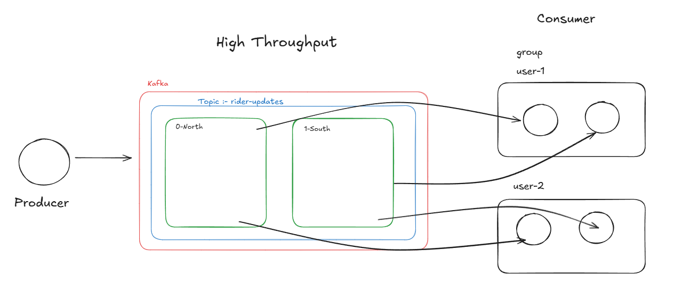
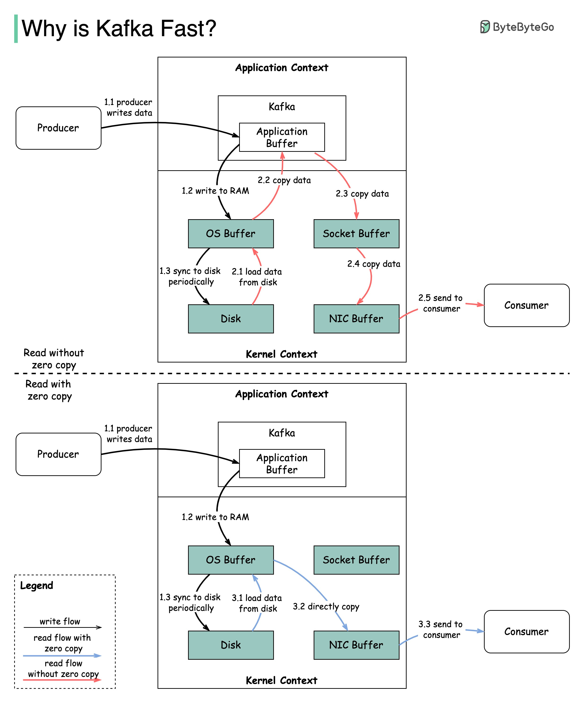

# 🚀 Kafka Rider Updates

This project demonstrates a simple **Kafka Producer & Consumer** application using [KafkaJS](https://kafka.js.org/).  
It simulates a rider location update system where producers send messages (rider name + location), and consumers process them.

---

## 📌 Architecture

The producer sends messages to a Kafka topic **`rider-updates`**, which is divided into two partitions:

- **Partition 0 → North riders**
- **Partition 1 → South riders**

Consumers are grouped into **consumer groups**, ensuring scalability and fault tolerance.



---


# 🚀 Why Kafka Is Fast



## ⚙️ Setup

### 1. Install dependencies
```sh
yarn install

**`Start Zookeepers`**

docker run -p 2181:2181 zookeeper

##Start Kafka


docker run -p 9092:9092 \
  -e KAFKA_ZOOKEEPER_CONNECT=192.168.0.105:2181 \
  -e KAFKA_ADVERTISED_LISTENERS=PLAINTEXT://192.168.0.105:9092 \
  -e KAFKA_OFFSETS_TOPIC_REPLICATION_FACTOR=1 \
  wurstmeister/kafka


📂 Project Structure

kafka-app/
│── client.js        # Kafka client setup
│── producer.js      # Producer logic
│── consumer.js      # Consumer logic
│── package.json
│── README.md


